<div align="center">


# GeoVisionAI

### AI-powered urban green-space analysis platform

> Research project: Evaluating the cooling effects of urban green spaces using remote sensing and deep learning — a case study of Lahore, Pakistan.

This project combines satellite imagery, geospatial analysis, and deep learning to identify urban green areas, measure surface temperature patterns, and estimate how vegetation affects urban cooling.

</div>

---

## Overview

This project is a remote sensing and geospatial AI platform for evaluating the cooling effect of urban green spaces in Lahore, Pakistan. The core goal is to combine satellite imagery with deep learning-based segmentation to identify green and non-green land cover, analyze how it changes over time, and study its relationship with urban temperature patterns.

GeoVisionAI is designed to support the full research workflow:

- prepare geospatial raster data for Lahore
- build image–mask training pairs for multi-class land-cover segmentation
- train or run a segmentation model for pixel-level classification
- extract green and non-green areas from prediction masks
- compare land-cover change across years and seasons
- evaluate patterns related to thermal cooling and urban environmental dynamics

This is not only an image-processing tool; it is an end-to-end geospatial AI system for urban environmental analysis.

---

## Research problem and project idea

The motivation behind this project is simple but important:

> Urbanization reduces vegetation and increases localized heat, which can worsen the urban heat island effect.

The project studies how urban green spaces such as parks, vegetation, tree cover, grasses, and other land-cover types influence the cooling behavior of the city. In practical terms, the project uses:

- remote sensing imagery
- geospatial preprocessing
- semantic segmentation
- temporal analysis
- environmental interpretation

The reason this project is stronger than a generic computer-vision task is that the output has real geographic and environmental meaning.

---

## Geographic scope

The study area is Lahore, Pakistan, which makes the project relevant to urban climate analysis in a fast-growing South Asian city context.

The system is built to process Lahore imagery across multiple years, with the general workflow supporting:

- multi-year temporal comparisons
- seasonal analysis
- area/land-cover trends
- spatial interpretation of green space patterns

---

## Dataset and data workflow

The project is based on geospatial raster data, especially GeoTIFF/TIF-based imagery, which is standard in remote sensing and GIS work.

The dataset workflow is expected to follow this general pattern:

1. Acquire satellite imagery covering Lahore
2. Prepare corresponding segmentation masks
3. Align image and mask pairs spatially
4. Tile, normalize, and clean the data
5. Train or run a segmentation model
6. Generate predicted land-cover masks
7. Quantify green and non-green coverage
8. Compare spatial and temporal trends for urban cooling analysis

The project is designed for multi-class semantic segmentation rather than a simple binary green/non-green classification. In other words, the model works at the pixel level and identifies different land-cover categories instead of treating the entire image as one class.

The project also supports the idea of a structured dataset layout such as:

```text
dataset/
├── train/
│   ├── images/
│   └── masks/
├── validation/
│   ├── images/
│   └── masks/
├── test/
│   ├── images/
│   └── masks/
└── README.md
```

---

## Deep learning and computer vision focus

The project focuses on semantic segmentation in a remote sensing context.

The general model pipeline is:

```text
Satellite image
        ↓
Preprocessing
        ↓
Image + mask dataset
        ↓
Deep learning model
        ↓
Pixel-wise classification
        ↓
Land cover mask
        ↓
Green-space extraction and analysis
```

This makes the work relevant to:

- computer vision
- deep learning
- semantic segmentation
- remote sensing
- geospatial AI
- environmental data analysis

---

## Key features

- Interactive GIS-style dashboard
- Deep learning segmentation using PyTorch and segmentation-models-pytorch
- Temporal analysis across multiple years/seasons
- Temperature and cooling effect comparison
- Report output and data export workflow
- Web dashboard and API support
- PostgreSQL-backed storage support
- Docker-ready deployment layout

---

## Project architecture

```text
GeoVisionAI/
├── accounts/                  # authentication and user management
├── gis/                      # Django project settings, routes, ML execution
├── web_dashboard/            # dashboard and analysis views
├── templates/                # shared frontend templates
├── static/                   # CSS and JS assets
├── data/                     # satellite and geospatial data
├── storage/                  # model and output storage
├── docs/                     # project docs and screenshots
├── .env.example              # environment template
├── .gitignore                # repo cleanup rules
├── docker-compose.yml        # Docker services
├── Dockerfile                # app container config
├── manage.py                 # Django entry point
├── requirements.txt          # Python dependencies
├── README.md                 # project documentation
├── LICENSE                   # licensing
└── myenv.yml                 # optional environment config
```

---

## Screenshots

The repository includes the full set of project screenshots from the provided image folder. These are stored under `docs/screenshots/` and displayed here in project order.

### Landing page and project overview

| No. | Screenshot |
|-----|------------|
| Home | 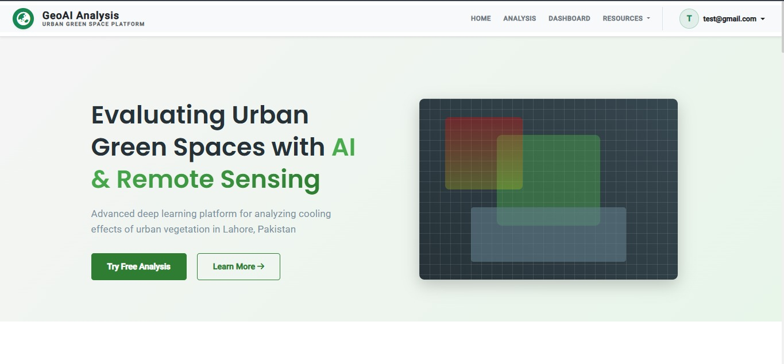 |
| 2 | 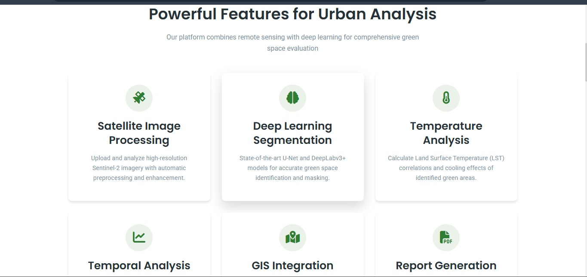 |
| 3 | 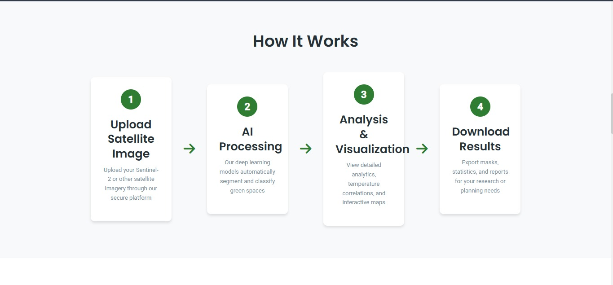 |
| 4 | 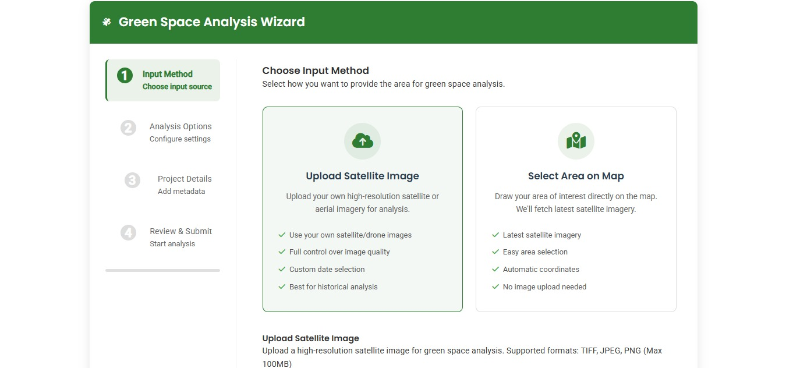 |
| 5 | 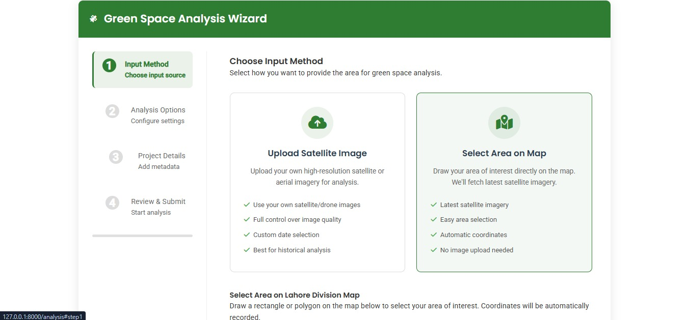 |
| 6 | 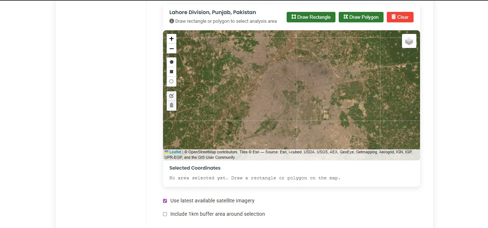 |
| 7 | 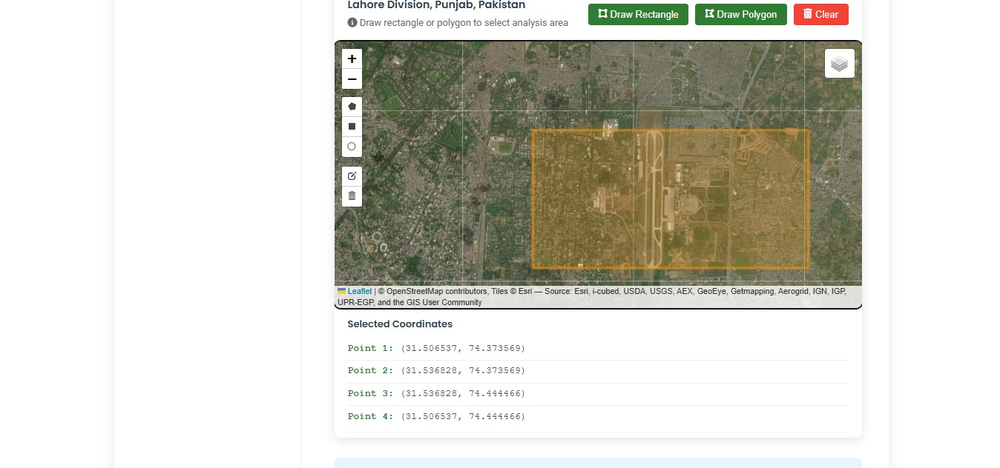 |
| 8 | 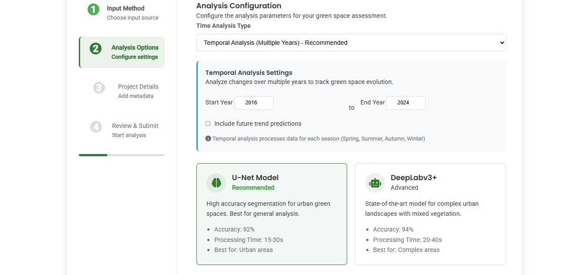 |
| 9 | 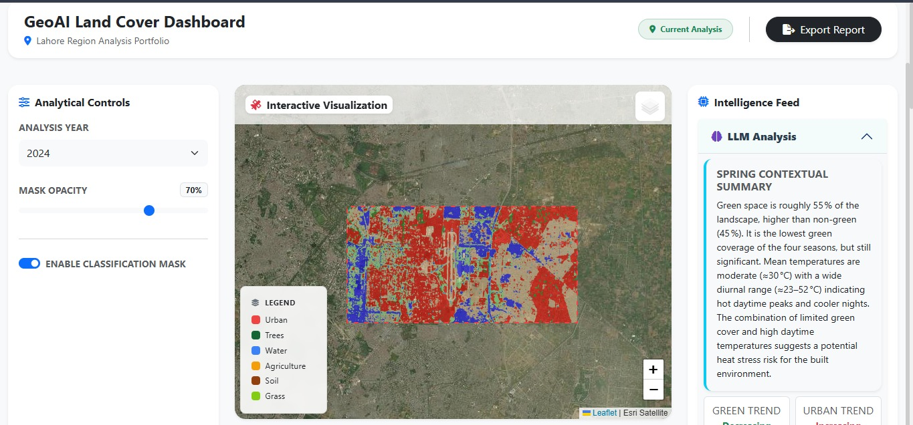 |
| 10 | 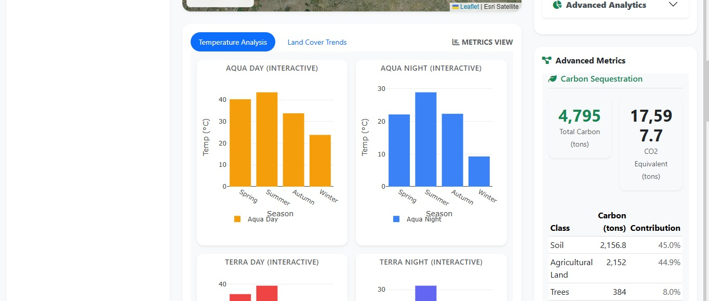 |
| 11 | 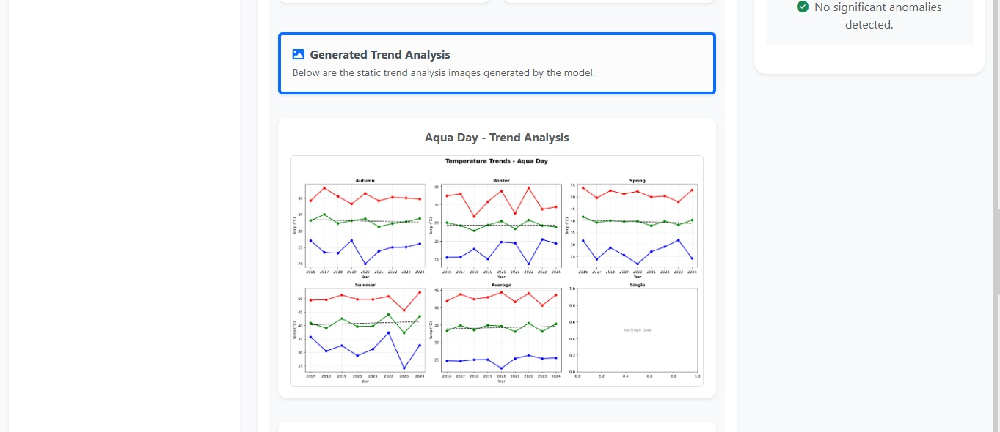 |
| 12 | 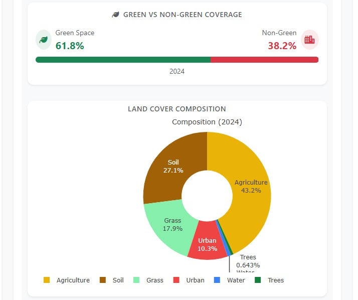 |
| 13 | 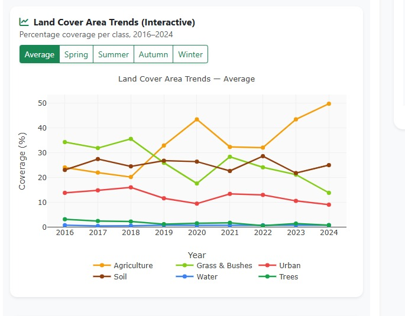 |
| 14 | 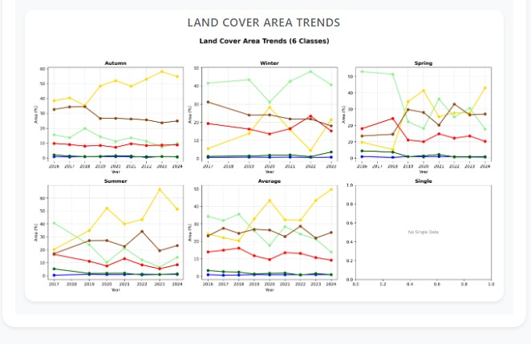 |
| 15 | 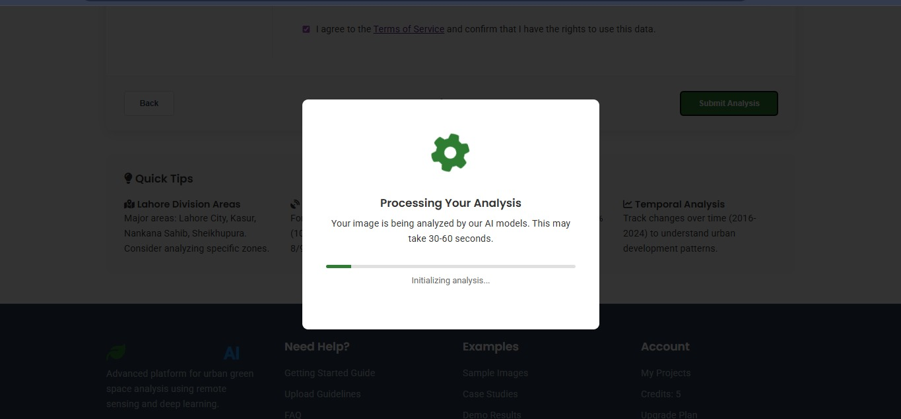 |
| 16 | 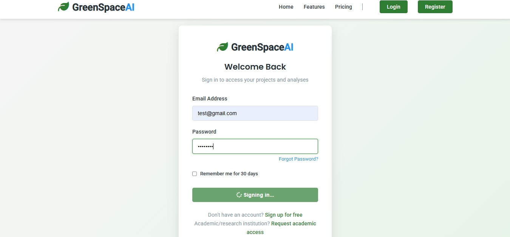 |
| 18 | 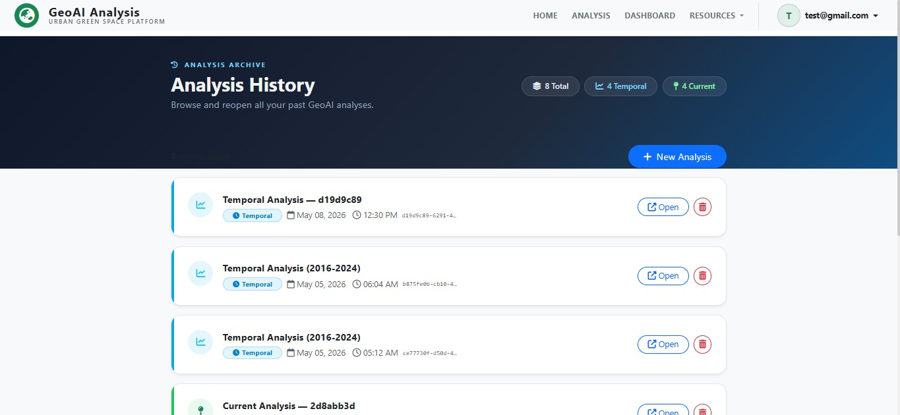 |

> The project includes all available numbered screenshots from the shared source folder in the correct numerical order so the README presents the full workflow and portfolio visually.

---

## Local setup

### Prerequisites

- Python 3.11+
- PostgreSQL 15+
- Git
- pip or conda
- Access to remote-sensing and cloud services if you want full runtime features

### 1. Clone the repository

```bash
git clone https://github.com/YOUR_USERNAME/GeoVisionAI.git
cd GeoVisionAI
```

### 2. Create a virtual environment

```bash
python -m venv venv
venv\Scripts\activate
pip install -r requirements.txt
```

### 3. Configure environment variables

```bash
copy .env.example .env
```

Then update the values in `.env` with your local database, secret, and external service settings.

Example:

```env
DJANGO_SECRET_KEY=replace-with-a-strong-secret-key
DJANGO_DEBUG=True
ALLOWED_HOSTS=localhost,127.0.0.1

DB_NAME=fyp_db
DB_USER=fyp_user
DB_PASSWORD=root
DB_HOST=localhost
DB_PORT=5433

AWS_REGION=ap-south-1
AWS_ACCESS_KEY_ID=your-aws-access-key
AWS_SECRET_ACCESS_KEY=your-aws-secret-key

GOOGLE_CLOUD_PROJECT=your-google-cloud-project-id
EARTHENGINE_PROJECT=your-google-cloud-project-id
GOOGLE_APPLICATION_CREDENTIALS=service-account.json

OPENAI_API_KEY=your-openai-key-if-used
HF_TOKEN=your-huggingface-token
```

### 4. Create the database

```bash
createdb fyp_db
python manage.py migrate
python manage.py createsuperuser
```

### 5. Run the app

```bash
python manage.py runserver
```

Open: http://127.0.0.1:8000

---

## Required external credentials and access

This project can use several external services depending on the feature you want to run. The app is already designed to read environment variables, so you should keep them in a local `.env` file and never commit them to GitHub.

### 1) AWS / S3 access

This project uses AWS-style cloud storage and access patterns in some parts of the pipeline. If you need S3 access, create an AWS account and do the following:

1. Go to AWS IAM
2. Create a user or role with the required permissions
3. Generate access keys
4. Save the values in `.env`:

```env
AWS_ACCESS_KEY_ID=your-access-key
AWS_SECRET_ACCESS_KEY=your-secret-key
AWS_REGION=ap-south-1
```

Typical required actions:

- S3 read/write access for project assets or image storage
- IAM permissions for object storage
- region selection for your bucket

If you do not use cloud storage in your local setup, leave these unset and the app will still run in local mode where possible.

### 2) Google Earth Engine access

The project contains Earth Engine initialization calls, which means it can integrate with Google Earth Engine for cloud-based geospatial analysis and temperature datasets.

To enable it:

1. Create or select a Google Cloud project
2. Enable Earth Engine API for that project
3. Authenticate with Google Earth Engine in the local environment
4. Set the project id used by the app

```env
GOOGLE_CLOUD_PROJECT=your-google-cloud-project-id
EARTHENGINE_PROJECT=your-google-cloud-project-id
```

Then run:

```bash
python
import ee

ee.Authenticate()
ee.Initialize(project="your-google-cloud-project-id")
```

If you do not have Earth Engine access, the app can still run in a reduced mode, but temporal Earth Engine-based metrics may not work.

### 3) Hugging Face access token

Some parts of the code use Hugging Face infrastructure for model or inference access. If your local implementation uses an external LLM or model endpoint, set:

```env
HF_TOKEN=your-huggingface-token
```

This is needed only when you are using a hosted model route or external inference layer.

### 4) OpenAI API key

If a feature uses an LLM or external API for insights, add:

```env
OPENAI_API_KEY=your-openai-key
```

This is optional depending on whether the project is currently using a local fallback or a hosted LLM route.

### 5) Django secret and app config

```env
DJANGO_SECRET_KEY=replace-with-a-strong-secret-key
DJANGO_DEBUG=True
ALLOWED_HOSTS=localhost,127.0.0.1
```

These values secure the Django app and allow local run configuration.

### 6) Database connection

```env
DB_NAME=fyp_db
DB_USER=fyp_user
DB_PASSWORD=root
DB_HOST=localhost
DB_PORT=5433
```

This project is configured to use PostgreSQL in the development setup.

---

## Docker setup

```bash
docker-compose up --build
```

Then run migrations and create a superuser if needed:

```bash
docker-compose exec web python manage.py migrate
docker-compose exec web python manage.py createsuperuser
```

---

## Model and data notes

- Model weights are intentionally not committed to GitHub because they are usually large.
- Place trained model files in `storage/models/` before running full inference.
- The project expects geospatial inputs and processed imagery for analysis workflows.
- For a full local run, make sure your dataset folders and raster files are correctly organized and accessible from the project directory.

---

## GitHub push guidance

If your friend has already uploaded the same project, do not force-push over their repository unless you are explicitly replacing it or the repository is fully yours.

The safest approach is:

1. create a new GitHub repository under your own account
2. or fork the existing repository and work from a personal branch
3. or push to a fresh repository such as `GeoVisionAI-FYP`

Typical commands:

```bash
git remote add origin https://github.com/YOUR_USERNAME/GeoVisionAI.git
git branch -M main
git push -u origin main
```

If the remote already exists and belongs to your friend, use a new repository or a fork instead of replacing it.

> The important rule is: do not overwrite someone else’s repo unless you have explicit permission.

---

## Project summary for GitHub and LinkedIn

A strong project description for this FYP is:

> A deep learning and remote sensing pipeline for multi-class semantic segmentation of urban land cover, followed by spatial and temporal analysis of green spaces to investigate their cooling impact across Lahore.

This captures the key technical story without overstating anything. It is accurate, recruiter-friendly, and grounded in the project’s actual objective.

---

## Team and project context

This project was developed as a Final Year Project focused on urban sustainability, remote sensing, and AI-based land-cover analysis.

---

## License

This project is licensed under the MIT License. See [LICENSE](LICENSE) for details.

---

## Acknowledgements

- European Space Agency (ESA) and Copernicus data platform
- Django and the Python geospatial ecosystem
- PyTorch and segmentation-models-pytorch
- Lahore urban climate research community


> ⚠️ The model weights file is **not included** in this repository due to size constraints.  
> See [storage/models/README.md](storage/models/README.md) for download instructions.

---

## 🔌 API Reference

| Endpoint | Method | Description |
|----------|--------|-------------|
| `/api/temporal-data/<result_id>/` | GET | Get full temporal analysis results |
| `/api/temporal-data/<result_id>/<year>/<season>/` | GET | Get results for specific year/season |
| `/api/rgb-image/<result_id>/<year>/<season>/` | GET | Get RGB satellite image |
| `/api/mask-image/<result_id>/<year>/<season>/` | GET | Get segmentation mask |
| `/api/chart-image/<result_id>/<chart_type>/` | GET | Get analysis chart |
| `/api/new-image/<year>/<season>/` | GET | Get current satellite image |

Full API documentation available at `/api_documentation` when running locally.

---

## 📦 Dependencies

| Category | Libraries |
|----------|-----------|
| **Web Framework** | Django 5.x, PostgreSQL |
| **Deep Learning** | PyTorch, segmentation-models-pytorch |
| **Geospatial** | Rasterio, GeoPandas, Shapely, PyProj, Folium |
| **Earth Engine** | earthengine-api |
| **Data Science** | NumPy, Pandas, SciPy, scikit-learn, scikit-image |
| **Visualization** | Matplotlib, Plotly |
| **AI/NLP** | LangChain, LangChain-OpenAI |
| **Computer Vision** | OpenCV (headless) |
| **Statistics** | pymannkendall |

---

## 🚀 Deployment

For production deployment:

1. Set `DEBUG=False` in `.env`
2. Set `ALLOWED_HOSTS` to your domain
3. Configure a production-grade web server (Gunicorn + Nginx)
4. Use a managed PostgreSQL instance
5. Configure static file serving (AWS S3 or similar)

---

## 👥 Team

This project was developed as a Final Year Project at **Punjab University**.

| Name | Role |
|------|------|
| Hassan Ali | Lead Developer — ML Pipeline, Backend, GIS |
| Salman Younas | [Role] |
| M.Hashir | [Role] |

**Supervisor**: DR.Ali
**Department**: BS Data Science  
**Year**: 2025–2026

---

## 📄 License

This project is licensed under the **MIT License** — see [LICENSE](LICENSE) for details.

---

## 🙏 Acknowledgements

- **European Space Agency (ESA)** for free access to Sentinel-2 imagery via [Copernicus Data Space](https://browser.dataspace.copernicus.eu/)
- **Google Earth Engine** for cloud-based geospatial processing
- **segmentation-models-pytorch** by Pavel Yakubovskiy
- **Rasterio** and the GDAL ecosystem

---

<div align="center">

Made with ❤️ in Lahore, Pakistan 🇵🇰

*GeoVisionAI — Seeing the City Through AI's Eyes*

</div>
